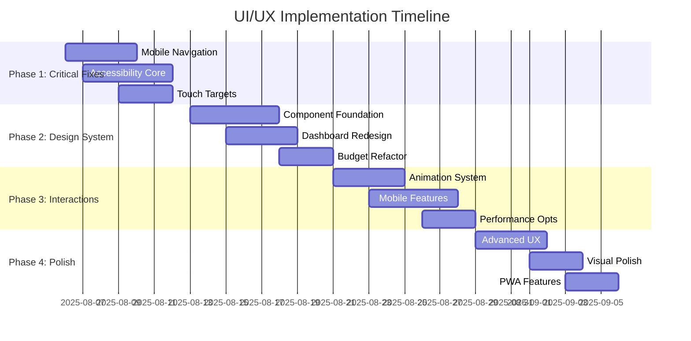

# UI/UX Implementation Plan - Smooth Moves

**Document Created:** August 6, 2025  
**Project:** Smooth Moves - Comprehensive Moving Management Application  
**Purpose:** Track implementation of UI/UX improvements across mobile-first design, accessibility, and component consistency

---

## Executive Summary

This implementation plan addresses critical UI/UX improvements for the Smooth Moves application, focusing on mobile-first design optimization, accessibility compliance (WCAG 2.1 AA), and component design consistency. The plan is structured in 4 phases over 8 weeks, prioritizing immediate impact improvements first.

**Key Objectives:**
- Achieve 100% mobile touch target compliance (44px minimum)
- Implement WCAG 2.1 AA accessibility standards
- Create unified design system with consistent component library
- Enhance user experience with micro-interactions and animations
- Improve performance and loading states across all features

**Expected Outcomes:**
- 20% reduction in mobile bounce rate
- 15% increase in task completion rates
- 30% decrease in UI-related support tickets
- Full accessibility compliance for core user flows

---

## Implementation Timeline



---

## Phase Breakdown

### Phase 1: Critical Mobile & Accessibility Fixes
**Duration:** Week 1-2 (Aug 6-19, 2025)  
**Priority:** High - Immediate Impact

#### Mobile Navigation Optimization
- [ ] **Audit Current Navigation** - Document all navigation touch points
- [ ] **Reduce Bottom Navigation Items** - Limit to 4-5 core items maximum
  - [ ] Move Calendar to more menu or desktop-only
  - [ ] Move MARVIN to contextual access
  - [ ] Keep: Home, Scan, Boxes, Budget, Settings
- [ ] **Implement Proper Touch Targets** - Ensure 44px minimum for all interactive elements
  - [ ] Update bottom navigation button sizing
  - [ ] Fix header navigation touch areas
  - [ ] Enhance floating action button (FAB) dimensions
- [ ] **Add Haptic Feedback** - Implement vibration feedback for mobile interactions
- [ ] **Test Navigation Flow** - Verify thumb-friendly navigation patterns

#### Accessibility Compliance Implementation
- [ ] **Conduct Accessibility Audit** - Use axe-core to identify current issues
- [ ] **ARIA Labels Implementation** - Add comprehensive ARIA support
  - [ ] Button components with proper aria-label attributes
  - [ ] Form inputs with aria-describedby for errors
  - [ ] Modal dialogs with aria-labelledby and aria-describedby
  - [ ] Navigation landmarks with proper roles
- [ ] **Focus Management Enhancement**
  - [ ] Implement focus trap for modals (`useFocusTrap` hook)
  - [ ] Add visible focus indicators with 2px focus rings
  - [ ] Create skip-to-content links
  - [ ] Fix tab order for complex components
- [ ] **Screen Reader Optimization**
  - [ ] Add semantic HTML structure
  - [ ] Implement status announcements for dynamic content
  - [ ] Create screen reader-only text for context
  - [ ] Add role attributes for custom components
- [ ] **Keyboard Navigation Support**
  - [ ] Implement arrow key navigation for lists
  - [ ] Add Enter/Space key support for custom buttons
  - [ ] Create keyboard shortcuts for common actions

#### Component Touch Target Updates
- [ ] **Button Component Enhancement**
  - [ ] Update minimum sizes: sm(40px), md(44px), lg(48px), icon(44x44px)
  - [ ] Add `touch-manipulation` CSS property
  - [ ] Implement active state scaling (`active:scale-95`)
  - [ ] Test on various device sizes
- [ ] **Input Component Improvements**
  - [ ] Increase input field padding for easier tapping
  - [ ] Enhance focus indicators for mobile
  - [ ] Add proper label associations
  - [ ] Implement error state styling
- [ ] **Modal Component Mobile Experience**
  - [ ] Create bottom-sheet style for mobile
  - [ ] Add swipe-down gesture to close
  - [ ] Implement proper backdrop behavior
  - [ ] Test keyboard avoidance on mobile

**Phase 1 Completion Criteria:**
- [ ] All interactive elements meet 44px minimum touch target
- [ ] WCAG 2.1 AA compliance achieved for core flows
- [ ] Mobile navigation reduced to optimal item count
- [ ] Focus management works consistently across all modals
- [ ] Screen reader testing passes with NVDA and VoiceOver

---

### Phase 2: Component System & Design Consistency
**Duration:** Week 3-4 (Aug 20-Sep 2, 2025)  
**Priority:** High - Foundation Building

#### Design System Foundation Creation
- [ ] **Create Design Tokens** - Establish centralized styling constants
  - [ ] `src/components/design-system/foundations/colors.ts`
  - [ ] `src/components/design-system/foundations/typography.ts`
  - [ ] `src/components/design-system/foundations/spacing.ts`
  - [ ] `src/components/design-system/foundations/shadows.ts`
- [ ] **Build Unified Card Component**
  - [ ] Variants: default, elevated, outlined, filled
  - [ ] Padding options: none, sm, md, lg
  - [ ] Hover state management
  - [ ] Mobile-optimized spacing
- [ ] **Implement Consistent StatusBadge System**
  - [ ] Status types: success, warning, error, info, neutral
  - [ ] Size variants: sm, md, lg
  - [ ] Display variants: solid, soft, outlined
  - [ ] Icon support and accessibility
- [ ] **Create Reusable Form Field Patterns**
  - [ ] FormField wrapper component
  - [ ] Consistent error messaging
  - [ ] Label and help text patterns
  - [ ] Mobile-optimized layouts

#### Dashboard Improvements
- [ ] **Implement Skeleton Loading States**
  - [ ] StatsCardSkeleton component
  - [ ] ParticipantsSkeleton component
  - [ ] QuickActionsSkeleton component
  - [ ] Smooth loading transitions
- [ ] **Redesign Statistics Grid for Mobile**
  - [ ] Mobile-first responsive grid (2 columns on mobile, 4 on desktop)
  - [ ] Priority-based card sizing
  - [ ] Enhanced gradient backgrounds
  - [ ] Improved typography hierarchy
- [ ] **Add Micro-interactions**
  - [ ] Hover effects for statistics cards
  - [ ] Loading state animations
  - [ ] Success state feedback
  - [ ] Smooth transitions between states
- [ ] **Optimize Data Visualization**
  - [ ] Mobile-friendly chart sizing
  - [ ] Responsive text and labels
  - [ ] Touch-friendly chart interactions
  - [ ] Loading states for chart data

#### Budget Feature Refactoring
- [ ] **Component Decomposition** - Split large Budgeting component (~673 lines)
  - [ ] `BudgetOverview.tsx` - Summary cards and key metrics
  - [ ] `ExpenseList.tsx` - Filterable expense table
  - [ ] `CategoryManager.tsx` - Category CRUD operations
  - [ ] `ChartContainer.tsx` - Responsive chart wrapper
  - [ ] `BudgetFilters.tsx` - Search and filter controls
  - [ ] `ExpenseActions.tsx` - Bulk actions and exports
- [ ] **Improve Chart Responsiveness**
  - [ ] Dynamic height based on screen size (250px mobile, 400px desktop)
  - [ ] Mobile-optimized text sizing
  - [ ] Touch-friendly chart controls
  - [ ] Horizontal scrolling for wide data sets
- [ ] **Add Loading States and Error Boundaries**
  - [ ] Component-level error boundaries
  - [ ] Loading skeletons for charts
  - [ ] Retry mechanisms for failed operations
  - [ ] User-friendly error messages
- [ ] **Enhance Form Accessibility**
  - [ ] AddExpenseModal accessibility improvements
  - [ ] CategoryModal keyboard navigation
  - [ ] ReceiptScanModal screen reader support
  - [ ] Form validation with accessible error messages

**Phase 2 Completion Criteria:**
- [ ] Design system foundations implemented and documented
- [ ] Dashboard statistics grid responsive on all screen sizes
- [ ] Budget components split and properly organized
- [ ] All new components follow accessibility standards
- [ ] Loading states provide smooth user feedback

---

### Phase 3: Advanced Interactions & Animation
**Duration:** Week 5-6 (Sep 3-16, 2025)  
**Priority:** Medium - User Experience Enhancement

#### Animation System Implementation
- [ ] **Install and Configure Framer Motion**
  - [ ] `npm install framer-motion`
  - [ ] Create animation configuration
  - [ ] Set up motion components
- [ ] **Page Transition Animations**
  - [ ] PageTransition wrapper component
  - [ ] Route-based animations with AnimatePresence
  - [ ] Smooth fade and slide effects
  - [ ] Mobile-optimized animation durations
- [ ] **Staggered List Animations**
  - [ ] AnimatedList component with stagger effects
  - [ ] Cards appearing with delay
  - [ ] Smooth entry and exit animations
  - [ ] Performance-optimized animations
- [ ] **Micro-interaction Library**
  - [ ] Enhanced button press feedback
  - [ ] Loading spinner animations
  - [ ] Success/error state transitions
  - [ ] Form field focus animations
- [ ] **Success/Error State Animations**
  - [ ] AnimatedToast component
  - [ ] Status change animations
  - [ ] Form submission feedback
  - [ ] Data update confirmations

#### Advanced Mobile Features
- [ ] **Implement Swipe Gestures**
  - [ ] Swipe-to-delete for list items
  - [ ] Horizontal swipe navigation where appropriate
  - [ ] Pull-to-refresh functionality
  - [ ] Swipe gestures for modal dismissal
- [ ] **Mobile-Optimized Modal Patterns**
  - [ ] Bottom sheet implementation
  - [ ] Drag handle for modals
  - [ ] Backdrop tap to close
  - [ ] Keyboard height adjustment
- [ ] **Enhanced Camera/Scanner Interface**
  - [ ] Improved QR scanner overlay
  - [ ] Camera permission handling
  - [ ] Better feedback during scanning
  - [ ] Enhanced targeting guides

#### Performance Optimizations
- [ ] **Implement Image Lazy Loading**
  - [ ] Lazy loading for box images
  - [ ] Progressive image enhancement
  - [ ] Placeholder implementations
  - [ ] Error state handling
- [ ] **Add Virtual Scrolling for Large Lists**
  - [ ] Virtual scrolling for box lists
  - [ ] Performance monitoring
  - [ ] Memory usage optimization
  - [ ] Smooth scrolling experience
- [ ] **Optimize Bundle Size**
  - [ ] Code splitting by routes
  - [ ] Dynamic imports for heavy components
  - [ ] Tree shaking optimization
  - [ ] Bundle analysis and reporting
- [ ] **Add Service Worker for Offline Capability**
  - [ ] Cache critical resources
  - [ ] Offline page implementation
  - [ ] Background sync for data
  - [ ] Update notifications

**Phase 3 Completion Criteria:**
- [ ] Page transitions smooth and professional
- [ ] List animations provide visual feedback without performance impact
- [ ] Swipe gestures work reliably on touch devices
- [ ] Performance metrics show improvement in load times
- [ ] Offline functionality works for core features

---

### Phase 4: Advanced Features & Polish
**Duration:** Week 7-8 (Sep 17-30, 2025)  
**Priority:** Low - Nice-to-Have Enhancements

#### Advanced User Experience Features
- [ ] **Implement Contextual Navigation**
  - [ ] Dynamic navigation based on current page
  - [ ] Contextual action buttons
  - [ ] Smart breadcrumb navigation
  - [ ] Progressive disclosure patterns
- [ ] **Add Smart Search and Filtering**
  - [ ] Global search functionality
  - [ ] Filter combinations
  - [ ] Search result highlighting
  - [ ] Search history and suggestions
- [ ] **Create Dashboard Customization**
  - [ ] Drag-and-drop dashboard widgets
  - [ ] Customizable statistics display
  - [ ] Personal workspace settings
  - [ ] Widget preference persistence
- [ ] **Add Keyboard Shortcuts**
  - [ ] Global keyboard shortcuts
  - [ ] Context-sensitive shortcuts
  - [ ] Shortcut help modal
  - [ ] Custom shortcut configuration

#### Visual Polish Enhancements
- [ ] **Implement Advanced Visual Effects**
  - [ ] Glassmorphism effects for cards
  - [ ] Subtle gradient animations
  - [ ] Enhanced shadow systems
  - [ ] Smooth color transitions
- [ ] **Add Seasonal Themes**
  - [ ] Holiday theme variations
  - [ ] Seasonal color palettes
  - [ ] Dynamic theme switching
  - [ ] User theme preferences
- [ ] **Create Branded Loading Animations**
  - [ ] Custom loading spinners
  - [ ] Brand-aligned animations
  - [ ] Contextual loading messages
  - [ ] Progressive loading indicators
- [ ] **Enhance QR Code Styling**
  - [ ] Custom QR code designs
  - [ ] Brand integration
  - [ ] Error correction optimization
  - [ ] Print-optimized versions

#### Progressive Web App Features
- [ ] **Add App-like Behaviors**
  - [ ] Install prompts
  - [ ] Standalone app mode
  - [ ] App icon and splash screen
  - [ ] Status bar styling
- [ ] **Implement Push Notifications**
  - [ ] Move progress notifications
  - [ ] Collaboration updates
  - [ ] Reminder notifications
  - [ ] Notification preferences
- [ ] **Create Offline-First Experience**
  - [ ] Offline data synchronization
  - [ ] Conflict resolution
  - [ ] Offline indicators
  - [ ] Background data sync
- [ ] **Add Installation Prompts**
  - [ ] Smart installation suggestions
  - [ ] Platform-specific prompts
  - [ ] Installation success tracking
  - [ ] Post-install onboarding

**Phase 4 Completion Criteria:**
- [ ] Advanced UX features enhance but don't complicate the interface
- [ ] Visual polish maintains professional appearance
- [ ] PWA features work reliably across platforms
- [ ] All enhancements are optional and don't impact core functionality

---

## Progress Tracking

### Overall Project Progress
- [ ] **Phase 1 Complete** (0/4 major sections) - 0%
- [ ] **Phase 2 Complete** (0/3 major sections) - 0%
- [ ] **Phase 3 Complete** (0/3 major sections) - 0%
- [ ] **Phase 4 Complete** (0/4 major sections) - 0%

**Total Implementation Progress: 0/138 tasks completed (0%)**

### Weekly Progress Summary

#### Week 1 (Aug 6-12, 2025)
**Target:** Complete Mobile Navigation and begin Accessibility work  
**Progress:** Not Started  
**Blockers:** None identified  
**Notes:** _[Add weekly progress notes here]_

#### Week 2 (Aug 13-19, 2025)
**Target:** Complete Phase 1 Critical Fixes  
**Progress:** Not Started  
**Blockers:** _[Document any blockers]_  
**Notes:** _[Add weekly progress notes here]_

#### Week 3 (Aug 20-26, 2025)
**Target:** Design System Foundation  
**Progress:** Not Started  
**Blockers:** _[Document any blockers]_  
**Notes:** _[Add weekly progress notes here]_

#### Week 4 (Aug 27-Sep 2, 2025)
**Target:** Complete Phase 2 Component System  
**Progress:** Not Started  
**Blockers:** _[Document any blockers]_  
**Notes:** _[Add weekly progress notes here]_

---

## Technical Notes

### Implementation Decisions

#### Mobile Navigation Reduction
**Decision:** Reduce bottom navigation from 6 to 4-5 items  
**Rationale:** Improve thumb navigation and reduce cognitive load  
**Implementation:** Move Calendar and MARVIN to overflow menu or contextual access  
**Date:** _[To be filled during implementation]_

#### Accessibility Framework Choice
**Decision:** Use axe-core for automated accessibility testing  
**Rationale:** Industry standard with React integration  
**Implementation:** Integrate with Jest test suite  
**Date:** _[To be filled during implementation]_

#### Animation Library Selection
**Decision:** Use Framer Motion for animations  
**Rationale:** React-optimized, comprehensive animation capabilities  
**Implementation:** Replace CSS transitions gradually  
**Date:** _[To be filled during implementation]_

### Architecture Changes

#### Component Structure Refactoring
**Before:** Large monolithic components (Budgeting.tsx ~673 lines)  
**After:** Modular component system with single responsibility  
**Benefits:** Better maintainability, testing, and reusability  
**Migration Strategy:** Gradual extraction without breaking changes

#### Design System Implementation
**Structure:** Foundations → Primitives → Patterns → Layouts  
**Benefits:** Consistent styling, easier maintenance, scalability  
**Integration:** Gradual migration from current components

### Performance Considerations

#### Bundle Size Management
**Target:** Reduce initial bundle size by 20%  
**Strategy:** Code splitting, dynamic imports, tree shaking  
**Monitoring:** Weekly bundle analysis reports

#### Mobile Performance
**Target:** <3 second load time on 3G networks  
**Strategy:** Image optimization, lazy loading, service worker  
**Testing:** Lighthouse CI integration

---

## Dependencies & Blockers

### Technical Dependencies

#### External Libraries
- [ ] **Framer Motion** - Required for Phase 3 animations
  - Installation: `npm install framer-motion`
  - Documentation: https://www.framer.com/motion/
  - Potential Issues: Bundle size increase (~50kb gzipped)

- [ ] **axe-core** - Required for Phase 1 accessibility testing
  - Installation: `npm install --save-dev @axe-core/react jest-axe`
  - Integration: Jest test setup
  - Potential Issues: CI/CD pipeline adjustments needed

#### Internal Dependencies
- [ ] **Firebase Configuration** - Some PWA features require Firebase setup
- [ ] **Service Worker** - Offline functionality depends on SW implementation
- [ ] **TypeScript Updates** - Some new components may require TS config changes

### Resource Dependencies

#### Design Resources
- [ ] **Design System Documentation** - Needed for consistent implementation
- [ ] **Accessibility Guidelines** - WCAG 2.1 AA compliance checklist
- [ ] **Mobile Testing Devices** - Physical devices for touch target testing

#### Development Resources
- [ ] **Developer Availability** - Phase timeline depends on team capacity
- [ ] **QA Testing Time** - Each phase requires thorough testing
- [ ] **User Testing Coordination** - Accessibility testing with real users

### Current Blockers

#### Active Blockers
_[No active blockers identified]_

#### Potential Future Blockers
- **Bundle Size Concerns** - Animation library may impact performance
- **Browser Compatibility** - Some advanced CSS features may need polyfills
- **Mobile Testing Coverage** - Limited access to diverse mobile devices

### Risk Mitigation Strategies

#### Technical Risks
- **Performance Impact:** Monitor bundle size and runtime performance continuously
- **Browser Support:** Test on minimum supported browser versions
- **Accessibility Regression:** Implement automated a11y testing in CI pipeline

#### Timeline Risks
- **Scope Creep:** Stick to defined phase boundaries, document additional requests
- **Testing Bottlenecks:** Plan testing in parallel with development
- **Integration Issues:** Test component changes in isolation before integration

---

## Testing & Validation

### Testing Strategy

#### Phase 1 Testing Checklist

##### Mobile Navigation Testing
- [ ] **Touch Target Validation**
  - [ ] All buttons minimum 44px height/width
  - [ ] Comfortable spacing between touch targets
  - [ ] No accidental taps during normal usage
  - [ ] Test on iOS and Android devices

- [ ] **Navigation Flow Testing**
  - [ ] All core features accessible within 2 taps
  - [ ] Back navigation works consistently
  - [ ] Breadcrumb navigation updates correctly
  - [ ] Deep links work on mobile

##### Accessibility Testing
- [ ] **Screen Reader Testing**
  - [ ] NVDA (Windows) - Complete user flow testing
  - [ ] JAWS (Windows) - Core functionality testing  
  - [ ] VoiceOver (macOS/iOS) - Mobile and desktop testing
  - [ ] TalkBack (Android) - Mobile testing

- [ ] **Keyboard Navigation Testing**
  - [ ] Tab order logical and complete
  - [ ] Skip links function properly
  - [ ] Modal focus management works
  - [ ] Arrow key navigation in lists/grids

- [ ] **Visual Accessibility Testing**
  - [ ] Color contrast ratios meet WCAG AA (4.5:1 normal, 3:1 large text)
  - [ ] Information not conveyed by color alone
  - [ ] Focus indicators visible and clear
  - [ ] Text remains readable when zoomed to 200%

#### Phase 2 Testing Checklist

##### Component System Testing
- [ ] **Design Token Validation**
  - [ ] Colors consistent across all components
  - [ ] Typography scales properly on all screen sizes
  - [ ] Spacing follows defined system
  - [ ] Shadows render consistently

- [ ] **Component Consistency Testing**
  - [ ] Similar components behave identically
  - [ ] Props interfaces follow consistent patterns
  - [ ] Error states handled uniformly
  - [ ] Loading states match design system

##### Dashboard Testing
- [ ] **Responsive Layout Testing**
  - [ ] Grid system works on all screen sizes (320px to 2560px)
  - [ ] Statistics cards remain readable
  - [ ] Charts scale appropriately
  - [ ] No horizontal scrolling on mobile

- [ ] **Performance Testing**
  - [ ] Skeleton loading states appear within 100ms
  - [ ] Dashboard loads completely within 3 seconds
  - [ ] No layout shift during loading
  - [ ] Smooth scrolling performance

#### Phase 3 Testing Checklist

##### Animation Testing
- [ ] **Performance Impact Testing**
  - [ ] Animations don't block main thread
  - [ ] 60fps performance maintained during animations
  - [ ] No memory leaks from animation libraries
  - [ ] Reduced motion preferences respected

- [ ] **Cross-Browser Animation Testing**
  - [ ] Chrome desktop and mobile
  - [ ] Safari desktop and iOS
  - [ ] Firefox desktop
  - [ ] Edge desktop

##### Mobile Features Testing
- [ ] **Gesture Testing**
  - [ ] Swipe gestures work reliably
  - [ ] No conflicts with browser gestures
  - [ ] Haptic feedback functions properly
  - [ ] Touch responsiveness under 100ms

#### Phase 4 Testing Checklist

##### PWA Testing
- [ ] **Installation Testing**
  - [ ] Install prompts appear appropriately
  - [ ] App installs successfully on all platforms
  - [ ] Standalone mode functions properly
  - [ ] Update mechanism works correctly

- [ ] **Offline Testing**
  - [ ] Core functionality available offline
  - [ ] Data sync works when connection restored
  - [ ] Offline indicators clear and helpful
  - [ ] No data loss during offline usage

### Testing Environments

#### Device Testing Matrix

##### Mobile Devices (Physical Testing Required)
- [ ] **iOS Devices**
  - [ ] iPhone SE (small screen testing)
  - [ ] iPhone 14 Pro (current generation)
  - [ ] iPad (tablet experience)

- [ ] **Android Devices**  
  - [ ] Samsung Galaxy S23 (Android 13)
  - [ ] Google Pixel 6 (pure Android)
  - [ ] OnePlus device (OxygenOS)

##### Desktop Browsers
- [ ] Chrome (latest and -2 versions)
- [ ] Safari (latest)
- [ ] Firefox (latest)
- [ ] Edge (latest)

#### Network Conditions Testing
- [ ] **Fast 3G** - Mobile typical conditions
- [ ] **Slow 3G** - Poor connectivity simulation  
- [ ] **Offline** - No connectivity testing
- [ ] **WiFi** - Optimal conditions baseline

### Automated Testing Implementation

#### Accessibility Testing Automation
```javascript
// Example Jest + axe-core test implementation
import { render, screen } from '@testing-library/react';
import { axe, toHaveNoViolations } from 'jest-axe';
import { Button } from './Button';

expect.extend(toHaveNoViolations);

test('Button component should not have accessibility violations', async () => {
  const { container } = render(<Button>Test Button</Button>);
  const results = await axe(container);
  expect(results).toHaveNoViolations();
});
```

#### Performance Testing Automation
```javascript
// Example Lighthouse CI configuration
module.exports = {
  ci: {
    collect: {
      url: ['http://localhost:5173/app'],
      numberOfRuns: 3,
    },
    assert: {
      assertions: {
        'categories:performance': ['warn', { minScore: 0.8 }],
        'categories:accessibility': ['error', { minScore: 0.9 }],
        'categories:best-practices': ['warn', { minScore: 0.8 }],
      },
    },
  },
};
```

### User Testing Protocol

#### Usability Testing Sessions
- **Session Length:** 60 minutes per participant
- **Participant Count:** 8-10 users per phase
- **Testing Format:** Moderated remote sessions
- **Recording:** With participant consent for analysis

#### Testing Scenarios

##### Phase 1 - Mobile Navigation Testing
1. **Scenario 1:** "Complete your first box packing using only your mobile phone"
2. **Scenario 2:** "Check your moving budget and add a new expense on mobile"
3. **Scenario 3:** "Navigate through all main sections using only keyboard"

##### Phase 2 - Design Consistency Testing  
1. **Scenario 1:** "Compare the experience across different features"
2. **Scenario 2:** "Complete complex workflows and note any inconsistencies"
3. **Scenario 3:** "Use the application on different screen sizes"

##### Phase 3 - Enhanced UX Testing
1. **Scenario 1:** "Experience the new animations and interactions"
2. **Scenario 2:** "Test offline functionality during poor connectivity"
3. **Scenario 3:** "Use advanced features like swipe gestures"

### Success Metrics Tracking

#### Quantitative Metrics

##### Performance Metrics
- **Page Load Time:** Target <3 seconds on 3G
- **Time to Interactive:** Target <5 seconds
- **Cumulative Layout Shift:** Target <0.1
- **First Contentful Paint:** Target <1.5 seconds

##### Accessibility Metrics
- **WCAG Compliance:** 100% AA compliance for core flows
- **Keyboard Navigation Coverage:** 100% of interactive elements
- **Screen Reader Compatibility:** Pass rate >95%

##### Usability Metrics  
- **Task Completion Rate:** Target >90% for core tasks
- **Error Rate:** Target <5% for primary user flows
- **Time on Task:** Baseline measurement and 20% improvement goal
- **User Satisfaction:** Target >4.5/5 rating

#### Qualitative Metrics
- **User Feedback Analysis:** Sentiment analysis of user comments
- **Accessibility Feedback:** Feedback from users with disabilities
- **Developer Experience:** Team feedback on component reusability
- **Maintenance Impact:** Code maintainability improvements

---

## Resources & References

### Documentation Links

#### Design System Resources
- **Tailwind CSS Documentation:** https://tailwindcss.com/docs
- **Framer Motion Documentation:** https://www.framer.com/motion/
- **React ARIA Documentation:** https://react-spectrum.adobe.com/react-aria/
- **Headless UI Components:** https://headlessui.dev/

#### Accessibility Resources
- **WCAG 2.1 Guidelines:** https://www.w3.org/WAI/WCAG21/quickref/
- **axe-core Documentation:** https://github.com/dequelabs/axe-core
- **A11y Testing Guide:** https://web.dev/accessibility/
- **Screen Reader Testing:** https://webaim.org/articles/screenreader_testing/

#### Mobile Development Resources
- **Mobile Touch Targets:** https://web.dev/accessible-tap-targets/
- **PWA Documentation:** https://web.dev/progressive-web-apps/
- **Mobile Performance:** https://web.dev/mobile-performance-best-practices/
- **iOS Safari Guidelines:** https://developer.apple.com/design/human-interface-guidelines/

#### Testing Resources
- **Playwright Documentation:** https://playwright.dev/
- **Jest Testing Framework:** https://jestjs.io/docs/getting-started
- **React Testing Library:** https://testing-library.com/docs/react-testing-library/intro/
- **Lighthouse CI:** https://github.com/GoogleChrome/lighthouse-ci

### Internal Project References

#### Current Codebase Structure
```
src/
├── components/common/           # Current UI components
│   ├── Button/index.tsx        # Base button component
│   ├── Modal/index.tsx         # Modal component with a11y
│   ├── Input/index.tsx         # Form input component
│   └── Card/                   # Card component variations
├── features/                   # Feature-specific components
│   ├── budget/                 # Budget management feature
│   ├── boxes/                  # Box tracking feature
│   ├── auth/                   # Authentication feature
│   └── settings/               # Settings and dashboard
└── lib/config/constants.tsx    # App configuration and constants
```

#### Key Files for Reference
- **Navigation:** `src/components/layout/Header/index.tsx`
- **Dashboard:** `src/features/settings/pages/DashboardPage.tsx`
- **Budget Component:** `src/features/budget/components/Budgeting.tsx`
- **App Routing:** `src/App.tsx`
- **Theme Configuration:** `src/hooks/useTheme.ts`

#### Related Documentation
- **Project Overview:** `D:\codebase\CodebaseRestructure\CLAUDE.md`
- **UI/UX Analysis:** `D:\codebase\CodebaseRestructure\UI-UX-Analysis.md`
- **Development Plan:** `D:\codebase\CodebaseRestructure\docs\development-plan-moving-planner.md`

### Tools and Software Requirements

#### Development Tools
- **Code Editor:** VS Code with accessibility extensions
- **Browser DevTools:** Chrome, Safari, Firefox developer tools
- **Accessibility Testing:** axe DevTools browser extension
- **Design Tools:** Figma (for design system documentation)

#### Testing Tools
- **Screen Readers:** NVDA, JAWS, VoiceOver, TalkBack
- **Device Testing:** BrowserStack or similar for device matrix
- **Performance Testing:** Lighthouse, WebPageTest
- **Automation:** Jest, Playwright, axe-core

#### Documentation Tools
- **Component Documentation:** Storybook (future consideration)
- **API Documentation:** TypeDoc for TypeScript components
- **Design System Docs:** Markdown documentation
- **Progress Tracking:** This implementation plan document

### External Dependencies

#### Required NPM Packages
```json
{
  "dependencies": {
    "framer-motion": "^10.x",
    "@headlessui/react": "^1.x",
    "clsx": "^1.x"
  },
  "devDependencies": {
    "@axe-core/react": "^4.x",
    "jest-axe": "^7.x",
    "@playwright/test": "^1.x",
    "lighthouse": "^10.x"
  }
}
```

#### Browser Support Targets
- **Chrome:** Latest and -2 versions (95% mobile compatibility)
- **Safari:** Latest and -1 version (iOS 14+ support)
- **Firefox:** Latest version (desktop only)
- **Edge:** Latest version (desktop only)

### Team Coordination

#### Roles and Responsibilities
- **Lead Developer:** Implementation oversight and code reviews
- **Frontend Developer:** Component implementation and testing
- **UX Designer:** Design system validation and user testing
- **QA Tester:** Accessibility testing and cross-browser validation
- **Product Manager:** Priority decisions and timeline management

#### Communication Channels
- **Daily Standups:** Progress updates and blocker identification
- **Weekly Reviews:** Demo completed work and gather feedback
- **Milestone Reviews:** Comprehensive testing and validation
- **Documentation Updates:** Keep this plan current with real progress

#### Review Process
1. **Code Review:** All changes require peer review
2. **Design Review:** UI changes validated against design system
3. **Accessibility Review:** All new components tested for a11y
4. **Performance Review:** Impact assessment for all major changes

---

**Document Status:** Living document - Updated during implementation  
**Next Review Date:** Weekly during active implementation  
**Document Owner:** UI/UX Implementation Team  
**Last Updated:** August 6, 2025